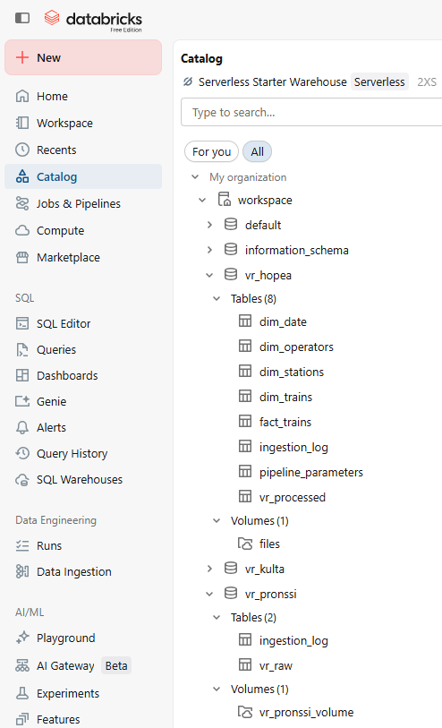
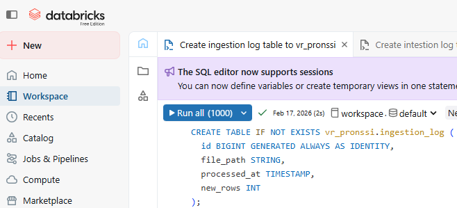
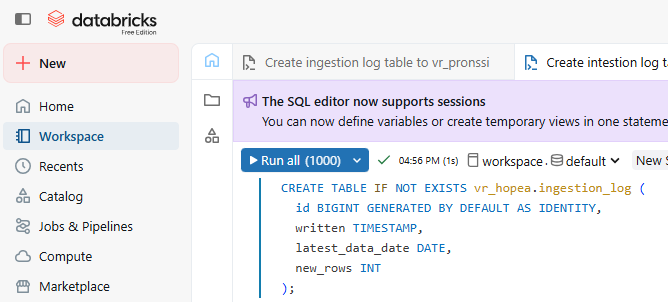
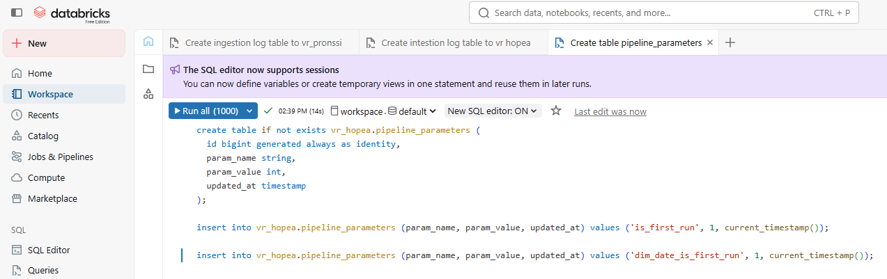
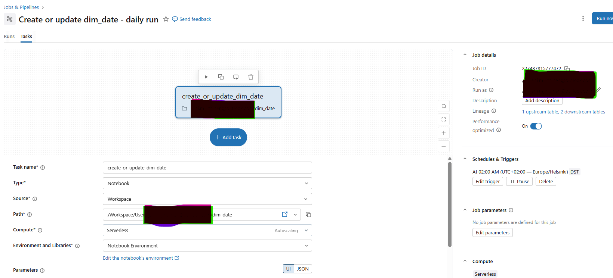
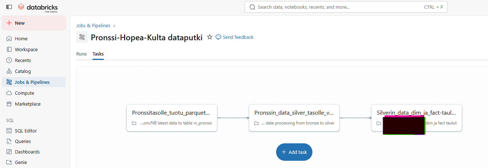

# VR:n junat - End-to-end dataprojekti mitaliarkkitehtuuria noudattaen - KESKEN
- Databricks ilmainen versio
- Notebookit Pyspark + Python + SQL
- Tiedonhaku Digitrafficin rajapinnasta ns. manuaalisena notebook-ajona Databricks free editionin rajoitteiden vuoksi

## Logiikka
- Ladattu v. 2024 ja 2025 datat rajapinnasta .zip-paketteina. Purettu .zip - vuosikohtainen pakattu tiedosto - sisältää 365 .json-tiedostoa, jotka muunnettiin .parquet-tiedostoiksi ja lopuksi yhdistettiin vuosikohtaiseksi .parquet-tiedostoksi.
- Viikkokohtainen data noudetaan jälkikäteen manuaalisella notebookin käynnistyksellä ja muunnetaan .parquet-tiedostoksi.
- Manuaalinen dim_date notebook ajo, joka loi päivätaulun dim_date hopea-tasolle / olisi voitu odottaa vuorokautista ajastettua ajoa... Ajetaan siis ajastettuna kerran vuorokaudessa, jolloin päivätauluun lisätään kuluva päivämäärä ja siihen liittyvät tiedot.
- Jokainen tiedosto viedään erikseen Databricksin pronssitasolle luotuun "volumeen". Tiedoston vienti käynnistää jobin / pipelinen:
  1. Data viedään raakamuodossa pronssitason deltatauluun.
  2. Data viedään hopeatasolle hopeatasolle määritellyssä muodossa.
  3. Dataputken ensiajolla luodaan fact- ja dim-taulut. Seuraavilla ajoilla dim-taulut muodostetaan uudestaan rivimäärän vähäisyyden vuoksi, mutta fact-tauluun lisätään uudet rivit.
 
  Kultatasoa ei ole vielä tehty. Nykyinen data on mallinnettu ja laadullisesti sopiva raportointiin -> Siirryn tässä kohtaan tekemään raportointia.
---

Mitaliarkkitehtuuri (kultatasoa ei ole vielä toteutettu)

---

Pronssitason lokitaulu

---
Hopeatason lokitaulu

---
Dataputken parametrit-taulu

---
dim_date ajastettu vuorokautinen päivitystyö

---
Dim- ja fact-taulujen muodostus / päivitys datankäsittelyineen, viikoittainen ajo

